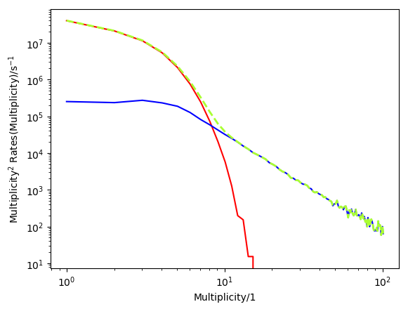

runwise_multiplicity
--------------------

### Monitoring the properties of the atmosphere relevant for the observation of cosmic rays and cosmic gamma rays with atmospheric Cherenkov telescopes

Amandeep Singh
Supervised by Prof. Dr. Adrian Biland

19th March, 2018

Atmospheric Cherenkov telescopes are a great tool for monitoring cosmic rays and cosmic gamma rays with energies above ~100GeV. However, atmospheric Cherenkov telescopes rely heavily on the atmosphere as a calorimeter. But the atmosphere changes over time, and it’s not exactly clear how these changes affect the performance of these telescopes. We propose here a method to monitor the properties of the atmosphere, using the telescope itself, not using external devices which may hinder the data taking of other nearby instruments by emitting light. To monitor the atmosphere, we take a look at the structure of the arrival-times (multiplicity) of single photons on the nanosecond level. Here we present correlations of the multiplicity of single photons with ambient and atmospheric properties. 

Keywords: Multiplicity, air shower, night sky background, Cherenkov Light, single photons, gamma rays, cosmic rays.

Figure: Subtracting the rates of multiplicities of the ‘pedestal’ trigger events (red) from the rates of multiplicities of the ‘physics’ trigger events (green) to obtain the rates of multiplicities of the air shower photons (blue).
